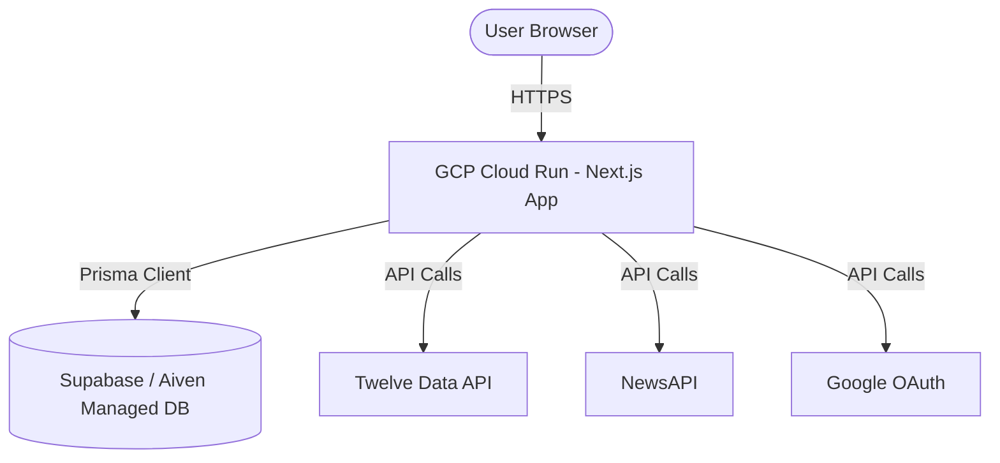

# FinanceAI - GCP Cloud Run Deployment Guide

This guide provides step-by-step instructions to deploy the **FinanceAI** application to **Google Cloud Platform (GCP)** using **Cloud Run** and an external managed database. This setup is highly cost-effective (free-tier friendly) and ideal for showcase/portfolio use.

---

## Architecture Overview



---

## Prerequisites

Before starting, make sure you have:
1. A **Google Cloud Platform (GCP)** account with billing enabled (GCP provides a $300 free trial credit).
2. A **GitHub** account with your project uploaded to a repository.
3. API keys for external services:
   * **Twelve Data** (Real-time market data)
   * **NewsAPI** (Financial news articles)
   * **Tavily** (AI search capabilities)
   * **Groq** (Llama 3 AI intelligence)

---

## Step 1: Set Up a Production Database

Since GCP Cloud Run containers are stateless (scale down to 0, data is erased on restart), using a local SQLite database (`dev.db`) is not suitable for production. We will use a managed SQL database.

### Choice 1: Supabase (PostgreSQL - Highly Recommended & Free)
1. Go to [Supabase](https://supabase.com/) and create a free account.
2. Create a new project named `ai-finance`.
3. Go to **Project Settings** -> **Database** and copy your **Transaction Connection String** (URI format, starting with `postgres://`).

### Choice 2: Aiven.io (MySQL - Free Tier)
1. Go to [Aiven](https://aiven.io/) and create an account.
2. Deploy a free **MySQL** instance.
3. Copy the MySQL URI connection string.

---

## Step 2: Configure Prisma for Production Database

Depending on which database you chose in Step 1, update the Prisma schema.

### For PostgreSQL (Supabase):
Open `backend/prisma/schema.prisma` and update the `datasource db` block:
```prisma
datasource db {
  provider = "postgresql"
  url      = env("DATABASE_URL")
}
```

### For MySQL (Aiven):
Keep it as:
```prisma
datasource db {
  provider = "mysql"
  url      = env("DATABASE_URL")
}
```

---

## Step 3: Add Dockerfile

Create a file named `Dockerfile` at the root of the project to package the Next.js standalone server:

```dockerfile
FROM node:18-alpine AS base

# Install dependencies only when needed
FROM base AS deps
RUN apk add --no-cache libc6-compat
WORKDIR /app

COPY package.json package-lock.json ./
RUN npm ci

# Rebuild the source code only when needed
FROM base AS builder
WORKDIR /app
COPY --from=deps /app/node_modules ./node_modules
COPY . .

ENV NEXT_TELEMETRY_DISABLED=1

# Generate Prisma Client
RUN npx prisma generate --schema=./backend/prisma/schema.prisma

RUN npm run build

# Production image, copy all the files and run next
FROM base AS runner
WORKDIR /app

ENV NODE_ENV=production
ENV NEXT_TELEMETRY_DISABLED=1

RUN addgroup --system --gid 1001 nodejs
RUN adduser --system --uid 1001 nextjs

COPY --from=builder /app/public ./public
RUN mkdir .next
RUN chown nextjs:nodejs .next

# Leverage Next.js standalone configuration
COPY --from=builder --chown=nextjs:nodejs /app/.next/standalone ./
COPY --from=builder --chown=nextjs:nodejs /app/.next/static ./.next/static
COPY --from=builder --chown=nextjs:nodejs /app/backend/prisma ./backend/prisma

USER nextjs

EXPOSE 3000
ENV PORT=3000
ENV HOSTNAME="0.0.0.0"

CMD ["node", "server.js"]
```

---

## Step 4: Configure GCP Services

1. Open the [GCP Console](https://console.cloud.google.com/).
2. Create a new project (e.g., `finsight-ai-portfolio`).
3. Enable the following APIs via the search bar:
   * **Cloud Run API**
   * **Cloud Build API**
   * **Artifact Registry API**

---

## Step 5: Setup Continuous Deployment from GitHub to Cloud Run

1. Navigate to the **Cloud Run** page in the GCP Console.
2. Click **Create Service**.
3. Under **Deployment source**, select **"Continuously deploy new revisions from a source repository"** and click **Set up with Cloud Build**.
4. Authenticate your GitHub account, select your repository, and click **Next**.
5. Set build configuration:
   * **Branch**: `main`
   * **Build Type**: `Dockerfile`
   * **Source directory**: `/` (root)
6. Click **Save**.

### Configure Cloud Run Settings:
* **Service Name**: `finsight-ai`
* **Region**: Select a region close to your target audience (e.g., `us-central1` or `asia-south1`).
* **CPU allocation and pricing**: Choose **"CPU is only allocated during request processing"** (scales to 0, cost is $0 when idle).
* **Ingress control**: Select **"Allow all traffic"** (to make it public).
* Click **Create**.

---

## Step 6: Configure Environment Variables in Cloud Run

Once the initial build begins, navigate to your Cloud Run service and configure the environment variables:

1. Click on your service `finsight-ai`, then click **Edit & Deploy New Revision**.
2. Scroll to the **Variables** tab.
3. Add the following **Environment Variables**:

| Variable Name | Value Description |
| :--- | :--- |
| `DATABASE_URL` | Your Supabase or Aiven database connection URI string |
| `NEXTAUTH_SECRET` | A random 32-character security key |
| `NEXTAUTH_URL` | Your Cloud Run URL (e.g., `https://finsight-ai-xxxxxx.a.run.app/finsight-ai`) |
| `TWELVE_DATA_API_KEY` | Your Twelve Data API Key |
| `NEWSAPI_API_KEY` | Your NewsAPI Key |
| `TAVILY_API_KEY` | Your Tavily Search API Key |

4. Click **Deploy**.

---

## Step 7: Push DB Schema & Verify

Before users can log in, push your schema migrations directly to your production cloud database from your local console:

1. Change `DATABASE_URL` in your local `.env` temporarily to your production connection string (e.g., Supabase/Aiven).
2. Run the following command:
   ```bash
   npx prisma db push --schema=./backend/prisma/schema.prisma
   ```
3. Once completed, revert your local `.env` back to `file:./dev.db` for local development safety.
4. Access your GCP Cloud Run service URL (e.g., `https://[your-service-url]/finsight-ai`) and enjoy your live production project!
